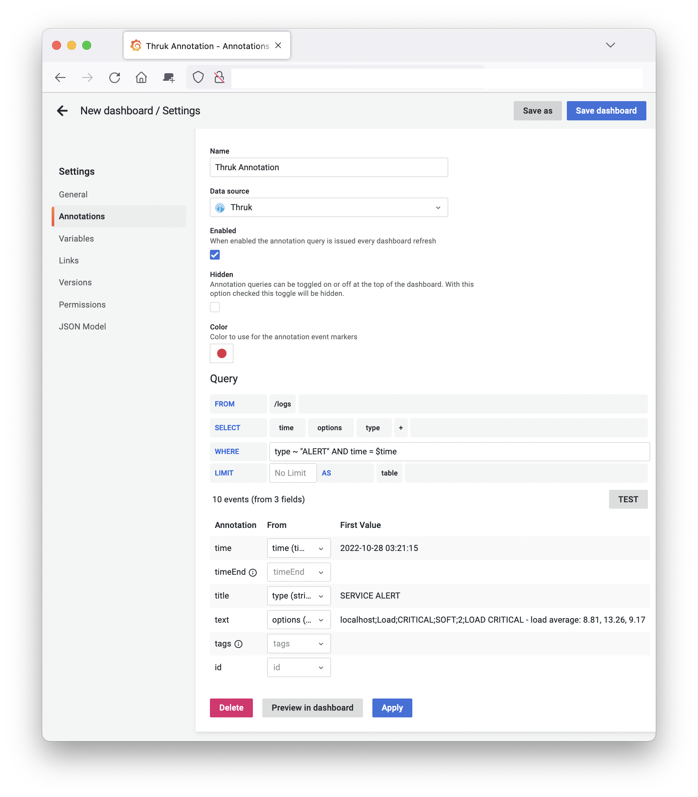
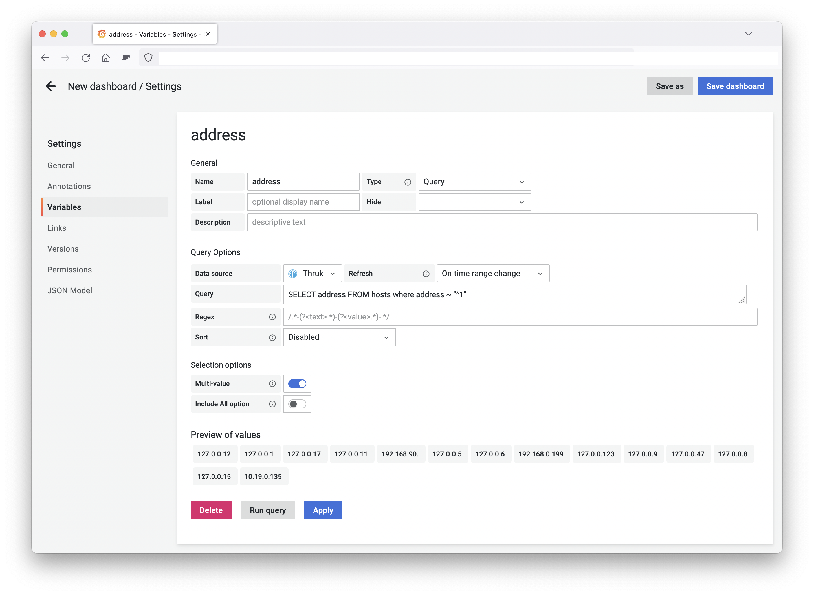

## Thruk Grafana Datasource - a Grafana backend datasource using Thruks REST API


### Installation

Search for `thruk` in the Grafana plugins directory or simply use the grafana-cli command:

    %> grafana-cli plugins install sni-thruk-datasource

Also [OMD-Labs](https://labs.consol.de/omd/) comes with this datasource included, so if
you use OMD-Labs, everything is setup already.

Otherwise follow these steps:

    %> cd var/grafana/plugins
    %> git clone -b release-1.0.4 https://github.com/sni/grafana-thruk-datasource.git
    %> restart grafana

Replace `release-1.0.4` with the last available release branch.

### Create Datasource

Add a new datasource and select:

Use the Grafana proxy.

    - Type 'Thruk'
    - Url to Thruk, ex.: 'https://localhost/sitename/thruk'

### Table Queries
Using the table panel, you can display most data from the rest api. However
only text, numbers and timestamps can be displayed in a sane way. Support for nested
data structures is limited.

Select the rest path from where you want to display data. Then choose all columns. Aggregation
functions can be added as well and always affect the column following afterwards.

### Variable Queries

Thruks rest api can be used to fill grafana variables. For example to get all
hosts of a certain hostgroup, use this example query:

```
  SELECT name FROM hosts WHERE groups >= 'linux'
```

### Annotation Queries

Annotation queries can be used to add logfile entries into your graphs.
Please note that annotations are shared across all graphs in a dashboard.

It is important to use at least a time filter.



### Single Stat Queries
Single stats are best used with REST endpoints which return aggregated values
already or use aggregation functions like, `avg`, `sum`, `min`, `max` or `count`.

### Timeseries based panels
Althouth Thruk isn't a timeseries databases und usually only returns table
data, some queries can be converted to fake timeseries if the panel cannot
handle table data.

You can either use queries which have 2 columns (name, value) or queries
which only return a single result row with numeric values only.

#### Statistic Data Pie Chart

For example the pie chart plugin can be used with stats queries like this:

```
  SELECT count() state, state FROM /hosts
```

The query is expected to fetch 2 columns. The first is the value, the second is the name.


#### Single Host Pie Chart

Ex.: Use statistics data for a single host to put it into a pie chart:

```
  SELECT num_services_ok, num_services_warn, num_services_crit, num_services_unknown FROM /hosts WHERE name = '$name' LIMIT 1
```


### Using Variables

Dashboard variables can be used in almost all queries. For example if you
define a dashboard variable named `host` you can then use `$host` in your
queries.

There is a special syntax for time filter: `field = $time` which will be
replaced by `(field >= starttime AND field <= endtime)`. This can be used to
reduce results to the dashboards timeframe.

```
  SELECT time, message FROM /hosts/$host/alerts WHERE time = $time
```

which is the same as

```
  SELECT time, message FROM /alerts WHERE host_name = "$host" AND time = $time
```



### Development

To test and improve the plugin you can run Grafana instance in Docker using
following command (in the source directory of this plugin):

  %> make grafanadev

This will expose local plugin from your machine to Grafana container. Now
run `make buildwatch` to compile dist directory and start changes watcher:

  %> make buildwatch

#### Testing

For testing you can use the demo Thruk instance at:

    - URL: https://demo.thruk.org/demo/thruk/
    - Basic Auth: test / test

#### Create Release

How to create a new release:

    %> export RELVERSION=1.0.7
    %> export GRAFANA_API_KEY=...
    %> vi package.json # replace version
    %> vi CHANGELOG.md # add changelog entry
    %> git commit -am "Release v${RELVERSION}"
    %> git tag -a v${RELVERSION} -m "Create release tag v${RELVERSION}"
    %> make GRAFANA_API_KEY=${GRAFANA_API_KEY} clean releasebuild
    # upload zip somewhere and validate on https://plugin-validator.grafana.net/
    # create release here https://github.com/sni/grafana-thruk-datasource/releases/new
    # submit plugin update here https://grafana.com/orgs/sni/plugins


### Changelog

see CHANGELOG.md
